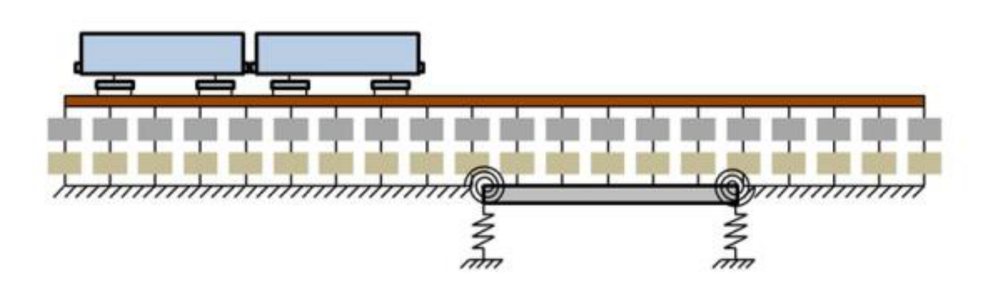
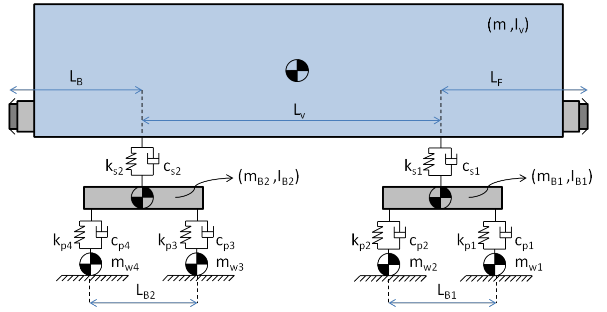
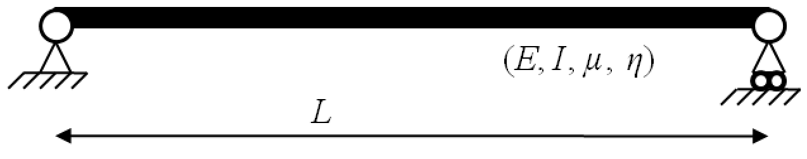
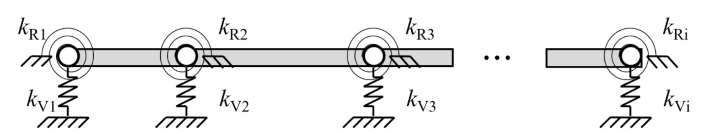
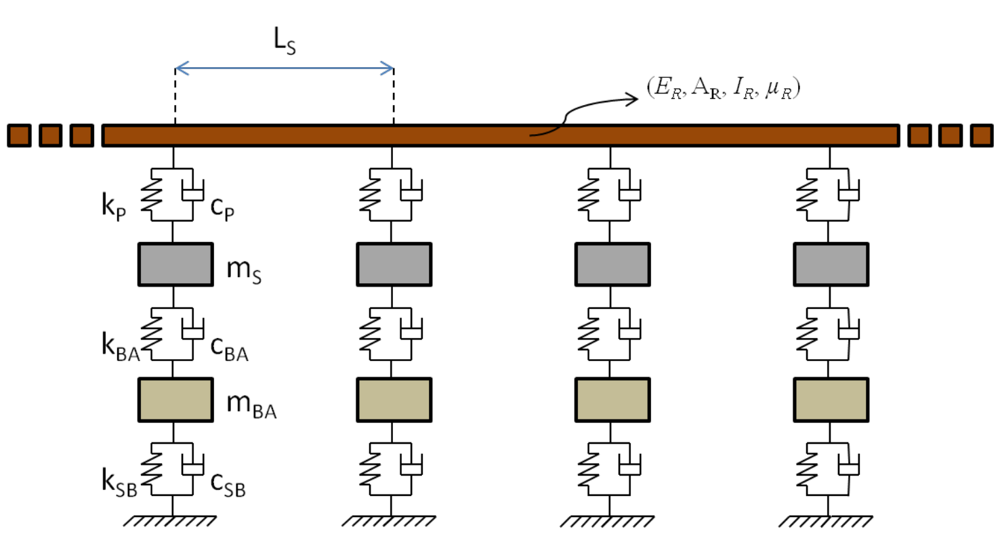
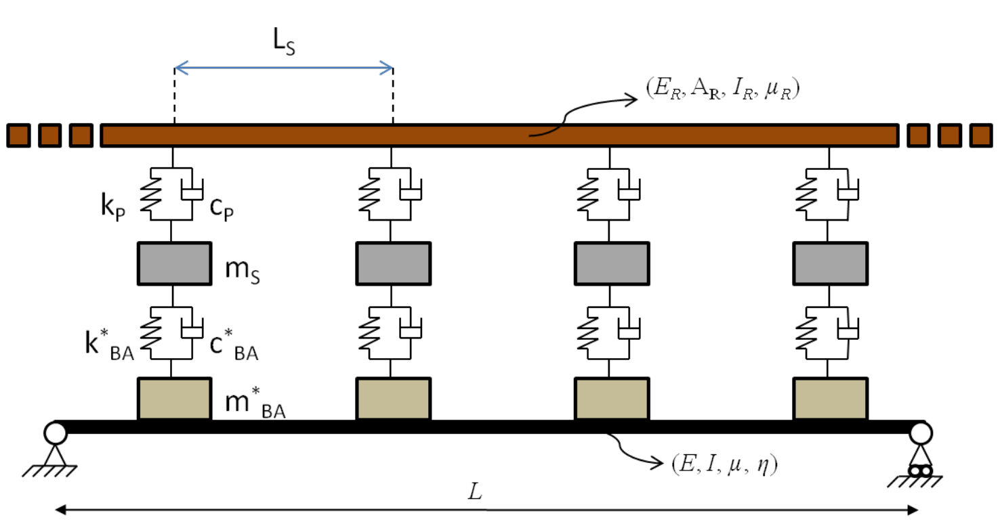
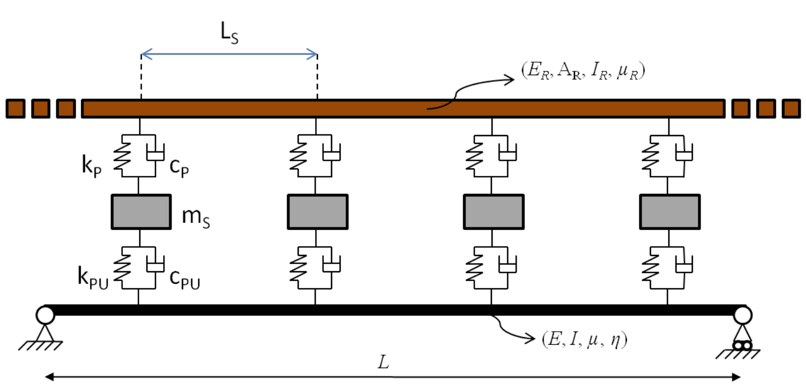
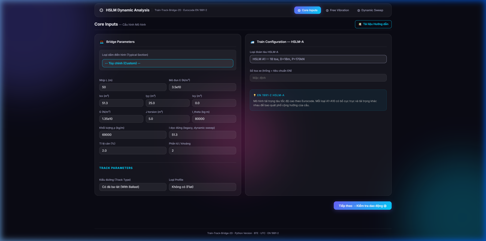
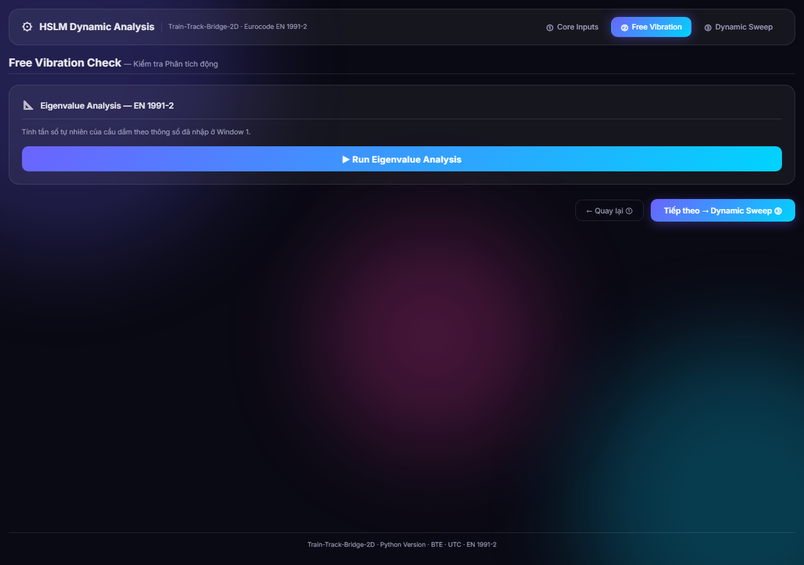
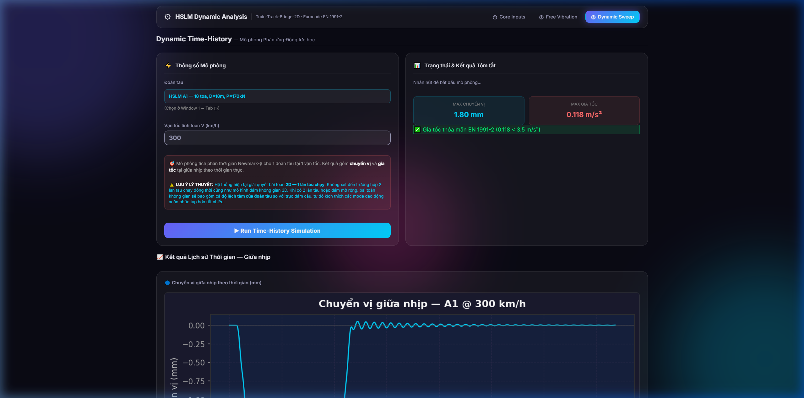

# Tài liệu Lý thuyết: Phân tích Động lực học Hệ Tàu - Đường - Cầu (TTB-2D)

## 1. Giới thiệu chung

Ứng dụng của chúng ta được xây dựng dựa trên cốt lõi là hệ thống **TTB-2D (Train-Track-Bridge in 2D)**. Đây là một công cụ mạnh mẽ dùng để mô phỏng và phân tích tương tác động lực học phức tạp giữa các thành phần: Phương tiện (Tàu), Đường ray, Lớp đá Ballast và Kết cấu Cầu.

Hiểu một cách đơn giản, khi một đoàn tàu di chuyển qua cầu, nó không chỉ tạo ra tĩnh tải mà còn gây ra các dao động động lực học. TTB-2D giúp chúng ta tính toán chính xác phản ứng của cầu, cũng như sự tương tác qua lại giữa bánh tàu và đường ray.


*Hình 1: Tổng quan về mô hình TTB-2D*

Mô hình xem xét một đoàn tàu (gồm nhiều toa xe) di chuyển trên đường ray từ trái sang phải với một vận tốc không đổi. Hệ thống đường ray bao gồm các thành phần từ trên xuống dưới: ray, đệm cao su (pad), tà vẹt (sleeper), đá ballast và lớp dưới ballast (sub-ballast). Một phần của đường ray được đặt trên cầu (mô phỏng như một dầm).

---

## 2. Mô tả các mô hình thành phần

Để đạt được sự cân bằng giữa độ chính xác và khối lượng tính toán, bài toán được chia thành các hệ thống con.

### 2.1. Mô hình Phương tiện (Vehicle Model)

Đoàn tàu được định nghĩa là một chuỗi các toa xe (vehicle) ghép nối với nhau. Mỗi toa xe được mô phỏng bằng một mô hình tập trung khối lượng (lumped masses), kết hợp với các thanh cứng, lò xo và bộ cản dịu (dashpots).


*Hình 2: Chi tiết mô hình toán học của một toa xe*

Các thành phần chính:
- **Bánh xe (Wheels):** Được xem như các khối lượng tập trung trượt trên ray.
- **Hệ thống treo sơ cấp (Primary suspension):** Liên kết giữa bánh xe và giá chuyển hướng (bogie), bao gồm lò xo và bộ cản dịu (đặc trưng bởi độ cứng $k_p$ và hệ số cản $c_p$).
- **Hệ thống treo thứ cấp (Secondary suspension):** Liên kết giữa giá chuyển hướng và thân toa xe chính ($k_s, c_s$).
- **Thân xe và Giá chuyển hướng:** Được mô phỏng là các thanh cứng có khối lượng ($m$) và mô men quán tính ($I$).

**Mở rộng Thư viện Tải trọng Tàu:**
Bên cạnh các dải tàu tiêu chuẩn **HSLM-A (A1–A10)** theo tiêu chuẩn châu Âu EN 1991-2, lõi mô phỏng đã tích hợp bổ sung các dòng tàu tốc độ cao thực tế trên thế giới và bộ tính năng linh hoạt:
- **🇨🇳 Chinese Star — Power Car** (Zhai et al., 2009): Bố trí cụm xe động lực nặng với phân bố tải trọng trục đặc thù của hạ tầng đường sắt cao tốc Trung Quốc.
- **🇯🇵 Shinkansen S300** (Wu & Yang, 2003): Mô hình chuỗi toa xe điển hình của Nhật Bản với mật độ khối lượng được tối ưu hóa.
- **⚙️ Tàu Tự định nghĩa (Custom Setup):** Cho phép người dùng hoặc sinh viên linh hoạt tùy chỉnh trực tiếp thông số cấu trúc từng khoang xe (khối lượng thân toa $m_{body}$, chiều dài toa $L_{body}$, khối lượng bogie $m_{bogie}$ và tải trọng trục $m_{wheel}$) thông qua giao diện điều khiển động.

### 2.2. Mô hình Kết cấu Cầu (Bridge Model)

Cầu được mô phỏng như một dầm Euler-Bernoulli sử dụng phương pháp Phần tử hữu hạn (FEM). 


*Hình 3: Mô hình dầm cầu Euler-Bernoulli*

Các thông số cơ bản bao gồm:
- **$L$:** Nhịp cầu
- **$E, I$:** Độ cứng uốn của mặt cắt dầm
- **$\mu$:** Khối lượng trên một đơn vị chiều dài
- **$\eta$:** Tỷ số cản (Damping ratio)

Ngoài ra, ứng dụng cho phép linh hoạt thiết lập các điều kiện biên. Cầu có thể là dầm giản đơn, dầm liên tục hoặc có các gối tựa đàn hồi.


*Hình 4: Dầm với nhiều gối tựa. Mỗi gối tựa có thể thiết lập độ cứng dọc trục ($k_V$) và độ cứng xoay ($k_R$)*

### 2.3. Mô hình Đường ray (Track Model)

Đường ray được mô phỏng là một dầm liên tục đặt trên các hệ thống khối lượng - lò xo phân bố tuần hoàn. Dầm đại diện cho ray, còn các khối lượng đại diện cho tà vẹt và lớp đá ballast.


*Hình 5: Mô hình chi tiết của hệ thống đường ray*

Hệ thống bao gồm các lớp liên kết:
- **Ray:** Mô phỏng bằng phần tử dầm (thông số $E_R, I_R, \mu_R$).
- **Đệm (Pads):** Lò xo và cản dịu thẳng đứng ($k_P, c_P$).
- **Tà vẹt (Sleepers):** Các khối lượng tập trung ($m_S$) đặt cách nhau một khoảng $L_S$.
- **Lớp đá Ballast & Sub-ballast:** Cung cấp độ cứng ($k_{BA}, k_{SB}$) và sự cản dịu từ nền đường.

### 2.4. Liên kết Đường ray trên Cầu (Track on Bridge)

Khi đường ray chạy ngang qua cầu, mô hình là sự kết hợp giữa mô hình Cầu và mô hình Đường ray. Ứng dụng hỗ trợ hai trường hợp thực tế:

**Trường hợp 1: Có lớp đá Ballast trên cầu**  
Khối lượng đại diện cho ballast sẽ nằm trực tiếp lên trên dầm cầu. Bề dày của lớp ballast trên cầu thường khác với trên nền đất cứng, do đó các thông số cơ học ($k^*_{BA}, c^*_{BA}$) cũng sẽ được hiệu chỉnh cho phù hợp.


*Hình 6: Mô hình đường ray trên cầu (có ballast)*

**Trường hợp 2: Không có đá Ballast (Bản mặt cầu chạy trực tiếp / Chân đế cố định)**  
Trong trường hợp này, tà vẹt được đặt trực tiếp lên dầm cầu thông qua một lớp đệm lót dưới tà vẹt (Pad Under sleeper - PU) với độ cứng $k_{PU}$ và cản dịu $c_{PU}$.


*Hình 7: Mô hình đường ray trên cầu (không có ballast)*

---

## 3. Phương trình Chủ đạo và Nguyên lý Giải số

### 3.1. Phương trình Vi phân Tổng quát

Phương trình vi phân chuyển động của một hệ cơ học có nhiều bậc tự do (MDOF) biểu diễn sự tương tác động lực học được viết dưới dạng ma trận như sau:

$$
[M]\{\ddot{x}\} + [C]\{\dot{x}\} + [K]\{x\} = \{F(t)\}
$$

Trong đó:
- $[M]$: Ma trận khối lượng của hệ thống (Mass matrix).
- $[C]$: Ma trận cản (Damping matrix), đặc trưng cho sự tiêu tán năng lượng.
- $[K]$: Ma trận độ cứng (Stiffness matrix).
- $\{x\}, \{\dot{x}\}, \{\ddot{x}\}$: Lần lượt là véc-tơ chuyển vị, vận tốc và gia tốc tại các bậc tự do của hệ thống.
- $\{F(t)\}$: Véc-tơ tải trọng tác dụng phụ thuộc vào thời gian $t$.

### 3.2. Tương tác Tàu - Hạ tầng (Vehicle - Infrastructure Interaction)

Khi tàu chạy trên đường ray hoặc cầu, hệ thống tổng thể được chia thành hai hệ thống con (Subsystems) tương tác qua lại lẫn nhau thông qua **lực tiếp xúc (Contact forces - $F_c$)** tại vị trí bánh xe. Phương trình chuyển động của từng hệ thống con được định nghĩa:

**Đối với hệ thống Phương tiện (Tàu):**

$$
[M_v]\{\ddot{x}_v\} + [C_v]\{\dot{x}_v\} + [K_v]\{x_v\} = \{F_{ext,v}\} - \{F_c\}
$$

**Đối với hệ thống Hạ tầng (Đường ray / Cầu):**

$$
[M_b]\{\ddot{x}_b\} + [C_b]\{\dot{x}_b\} + [K_b]\{x_b\} = \{F_{ext,b}\} + \{F_c\}
$$

Trong đó:
- Chỉ số $v$ (vehicle) và $b$ (bridge/track) đại diện cho các ma trận của tàu và kết cấu bên dưới.
- Lực tương tác $\{F_c\}$ không phải là hằng số. Nó phụ thuộc trực tiếp vào khối lượng không treo của bánh tàu, độ cứng điểm tiếp xúc, chuyển vị tương đối giữa bánh tàu và mặt ray, yếu tố hình học của biên dạng ray (profile irregularities), và vận tốc tàu $V$. 

Sự di chuyển của lực tiếp xúc $\{F_c\}$ dọc theo chiều dài cầu chính là nguyên nhân làm cho bài toán trở nên **phi tuyến (non-linear)** và **phụ thuộc thời gian (time-dependent)**, mặc dù bản thân vật liệu và kết cấu của từng hệ thống con được giả định là tuyến tính.

### 3.3. Giải pháp Tích phân Số (Numerical Solution)

Để tính toán sự kết hợp (coupled system) của hai phương trình trên, TTB-2D gộp chúng lại thành một hệ phương trình ma trận đồ sộ:

$$
\begin{bmatrix}
M_v & 0 \\
0 & M_b
\end{bmatrix}
\begin{Bmatrix}
\ddot{x}_v \\
\ddot{x}_b
\end{Bmatrix}
+
\begin{bmatrix}
C_v & C_{v,b} \\
C_{b,v} & C_b
\end{bmatrix}
\begin{Bmatrix}
\dot{x}_v \\
\dot{x}_b
\end{Bmatrix}
+
\begin{bmatrix}
K_v & K_{v,b} \\
K_{b,v} & K_b
\end{bmatrix}
\begin{Bmatrix}
x_v \\
x_b
\end{Bmatrix}
=
\begin{Bmatrix}
F_v \\
F_b
\end{Bmatrix}
$$

**Chiến lược Tích phân Hai giai đoạn (Dual-Stage Simulation Protocol):**
Để giải quyết bài toán tối ưu hóa tài nguyên tính toán trên nền tảng đám mây nhưng vẫn thu thập đầy đủ dữ liệu quan sát dao động của kết cấu, giải thuật tích phân thời gian **Newmark-$\beta$** được tối ưu hóa thành chuỗi hai bước liên tiếp:
1. **Giai đoạn 1 (Tương tác Tàu – Đường – Cầu):** Cập nhật liên tục ma trận hệ thống thay đổi theo thời gian và tích phân với bước thời gian cực nhỏ ($dt \approx 0.0003\text{s}$) trong suốt quá trình đoàn tàu lăn bánh trên dầm để đảm bảo độ chính xác vật lý cao nhất.
2. **Giai đoạn 2 (Dao động Tự do Tắt dần - Decay Tail):** Ngay khi trục bánh xe cuối cùng rời khỏi dầm cầu, hệ phương trình lập tức ngắt bỏ các ma trận tương tác và chuyển hoàn toàn về phương trình dao động tự do của dầm độc lập. Giai đoạn này sử dụng bước thời gian thưa hơn rất nhiều ($dt_{tail} = 0.01\text{s}$) để mở rộng theo dõi thêm **10.0 giây** đường cong dao động tắt dần mà không gây gánh nặng thời gian xử lý cho máy chủ.

Kết quả xuất ra bao gồm chuyển vị, biến dạng, gia tốc tại các nút và dải phân bố lực tiếp xúc theo thời gian.

---

## 4. Hướng dẫn sử dụng Phần mềm (Web App)

Trang phân tích động lực học trực tuyến cung cấp một giao diện trực quan và thân thiện, được chia làm 3 bước (tab) tương ứng với quy trình tính toán động lực học tiêu chuẩn.

### 4.1. Core Inputs - Cấu hình Mô hình

Đây là bước thiết lập các thông số cơ bản cho Cầu, Đường ray và Tàu.


*Hình 8: Giao diện thiết lập thông số mô hình (Core Inputs)*

**Thông số Cầu (Bridge Parameters):**
- **Loại dầm điển hình:** Cho phép chọn các mẫu dầm có sẵn (như dầm hộp HSR, dầm thép) giúp điền tự động các giá trị.
- **Nhịp L (m) / Mô đun E (N/m²):** Chiều dài nhịp cầu và mô đun đàn hồi của vật liệu.
- **Ixx, Iyy, Ixy, G, J, v.v...:** Các đặc trưng hình học và xoắn của mặt cắt ngang dầm. 
- **Khối lượng $\rho$ (kg/m):** Khối lượng phân bố đều trên một mét dài của cầu.
- **Tỉ lệ cản (%):** Tỷ lệ cản (Damping ratio), thường chọn từ 1% đến 2% cho cầu bê tông cốt thép.

**Thông số Đường ray (Track Parameters):**
- **Kiểu đường (Track Type):** Chọn loại đường có đá ballast hoặc không có đá ballast.
- **Loại Profile:** Lựa chọn biên dạng bề mặt ray (phẳng, gờ nhân tạo, hoặc theo phổ ngẫu nhiên PSD).
- **Tiêu chuẩn phổ PSD:** (Chỉ áp dụng khi chọn phổ PSD) Chọn tiêu chuẩn đường sắt tương ứng (Chinese HSR, Eurocode, FRA, v.v...).

**Thông số Tàu (Train Configuration):**
- Lựa chọn dải tàu HSLM-A tiêu chuẩn, tàu thực tế quốc tế (Chinese Star, Shinkansen), hoặc kích kích hoạt bảng tự nhập thông số thiết kế riêng biệt.

### 4.2. Free Vibration - Kiểm tra Phân tích động

Sau khi thiết lập cấu hình, hệ thống sẽ tính toán các Tần số tự nhiên (Natural Frequencies) của cầu.


*Hình 9: Giao diện kiểm tra tần số dao động (Free Vibration)*

**Ý nghĩa các thao tác:**
- Nút **Run Eigenvalue Analysis:** Nhấn để hệ thống giải bài toán trị riêng (Eigenvalue) và tìm ra các tần số dao động riêng.
- **Bảng kết quả:** Hiển thị các mode dao động tương ứng với tần số $f$ (Hz). Hệ thống sẽ tự động so sánh tần số cơ bản ($n_0$) với các giới hạn trong tiêu chuẩn EN 1991-2 để đưa ra kết luận (Verdict) xem cây cầu này **có bắt buộc** phải phân tích động lực học (Dynamic Analysis) hay không.

### 4.3. Dynamic Time-History - Mô phỏng Phản ứng Động lực học

Đây là bước chạy mô phỏng chi tiết phản ứng kết cấu theo miền thời gian.


*Hình 10: Giao diện bảng điều khiển mô phỏng thời gian thực (Dynamic Time-History)*

**Thông số Mô phỏng:**
- **Đoàn tàu:** Tự động lấy cấu hình đã chọn ở Window 1.
- **Vận tốc tính toán V (km/h):** Nhập trực tiếp tốc độ thiết kế mong muốn mô phỏng.

**Khung Báo cáo & Giới hạn Lý thuyết (Critical Restrictions):**
- **Đầu ra Lịch sử Thời gian:** Xuất trực tiếp biểu đồ độ võng (mm) và biểu đồ gia tốc giữa nhịp (m/s²) trải dài xuyên suốt từ thời điểm tàu chạy qua dầm cho đến hết chuỗi 10 giây dao động tự do tắt dần. Hệ thống tự động đối chiếu giá trị đỉnh gia tốc với tiêu chuẩn cho phép (EN 1991-2 quy định $\le 3.5\text{ m/s}^2$ đối với dầm bê tông ballast).
- ⚠️ **LƯU Ý KHÔNG GIAN (Planar 2D Limitations):** Bài toán hiện tại được giới hạn phân tích cho mô hình **2D — 1 làn tàu chạy**. Ứng dụng **không xét đến** trường hợp 2 làn tàu chạy ngược/xuôi chiều đồng thời cũng như mô hình dầm không gian 3D. Lý do cốt lõi là khi có 2 làn tàu hoạt động hoặc mô hình dầm mở rộng, tác động của đoàn tàu sẽ bao gồm cả **độ lệch tâm** của tải trọng trục so với tâm hình học dầm cầu. Độ lệch tâm này sẽ kích thích các mode dao động xoắn không gian phức tạp hơn rất nhiều so với ứng xử uốn phẳng thuần túy của dầm 2D đơn làn.

---

## 5. Hướng dẫn Cài đặt & Khởi chạy (Quick Start)

### 5.1. Yêu cầu hệ thống
- Python >= 3.8
- numpy >= 1.20
- scipy >= 1.7
- matplotlib >= 3.4

Cài đặt các thư viện phụ thuộc thông qua `pip`:
```bash
pip install -r requirements.txt
```

### 5.2. Khởi chạy Mô phỏng
- **Mô phỏng đơn (Single Simulation):** Phân tích chi tiết một kịch bản đoàn tàu cụ thể.
  ```bash
  python A00_Run.py
  ```
- **Quét dải tốc độ hàng loạt (HSLM Batch Sweep):** Tự động phân tích dải tàu HSLM-A1 đến A10 theo tiêu chuẩn EN 1991-2 để tìm vận tốc và đoàn tàu nguy hiểm nhất.
  ```bash
  python A00_Run_HSLM_Sweep.py
  ```
